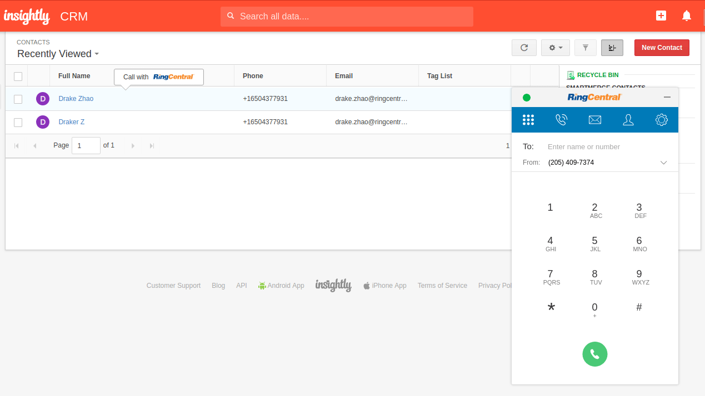
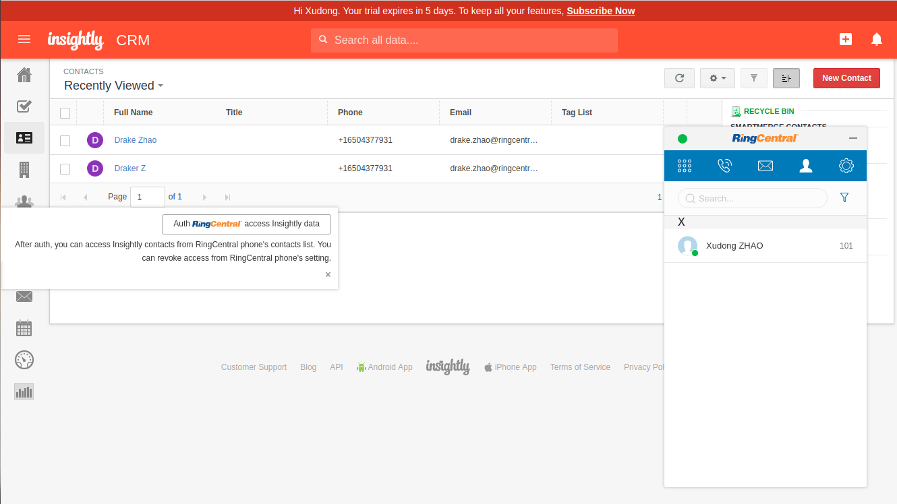
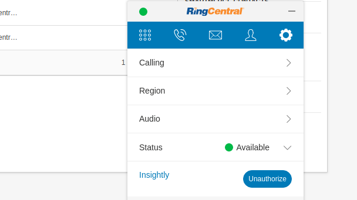
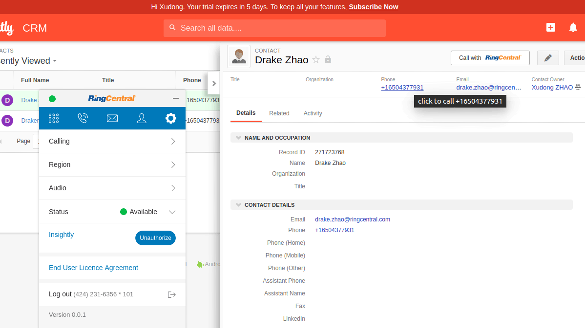
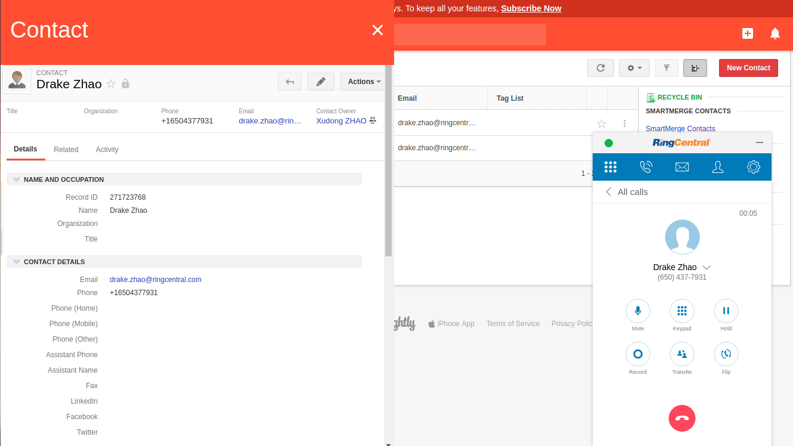

# Insightly Embeddable RingCentral phone

Add RingCentral Embeddable Voice widgets to insightly.com

Created with [ringcentral-embeddable-extension-factory](https://github.com/ringcentral/ringcentral-embeddable-extension-factory), you could create similar extension for other CRM sites.

## YouTube video

[https://youtu.be/wEK-y_GrCGs](https://youtu.be/wEK-y_GrCGs)

## Screenshots

| screenshots            |  screenshots |
:-------------------------:|:-------------------------:
 | 
 | 
 |

## Features

- Click to call button
- Popup caller info panel when call inbound
- Build with custom app config
- Show contact event from RingCentral Widgets
- Manully/auto Sync Call log to insightly contact event, [About auto call log sync feature](https://github.com/ringcentral/hubspot-embeddable-ringcentral-phone/issues/137).
- Check hubspot activities from ringcentral contact panel
- Custom X-USER-AGENT header for api request
- Active call control

## Try it

- Download the zip from release page: [https://github.com/ringcentral/insightly-embeddable-ringcentral-phone/releases](https://github.com/ringcentral/insightly-embeddable-ringcentral-phone/releases)
- Unpack it, get a dist folder, open your chrome extension page(chrome://extensions/), click load unpacked, select the dist folder
- Go to `https://crm.*.insightly.com` to check
- Make sure you ***turn off*** `Block third-party cookies` in `chrome://settings/content/cookies`

## Build and Use

1. build `content.js`

```bash
git clone https://github.com/ringcentral/insightly-embeddable-ringcentral-phone.git
cd insightly-embeddable-ringcentral-phone
npm i
cp config.sample.js config.js
# then run it
npm start
# edit src/*.js, webpack will auto-rebuild
```

1. Go to Chrome extensions page.
2. Open developer mode
3. Load `insightly-embeddable-ringcentral-phone/dist` as unpacked package.
4. Go to `https://crm.*.insightly.com` to check

## Build with custom RingCentral clientID/appServer

- Create an app from [https://developer.ringcentral.com](https://developer.ringcentral.com), make sure you choose a browser based app, and set all permissions, and add `https://ringcentral.github.io/ringcentral-embeddable/redirect.html` to your redirect URI list, Edit `config.js`,
- Fill your RingCentral app's clientID and appServer in `config.js`

```js

  ringCentralConfigs: {
    // your ringCentral app's Client ID
    clientID: 'your-clientID',

    // your ringCentral app's Auth Server URL
    appServer: 'your ringCentral app Auth Server URL'
  },
```

## Credits

Created with [Embbnux Ji](https://github.com/embbnux)'s tuturial:
 [Building Chrome Extension Integrations with RingCentral Embeddable](https://medium.com/ringcentral-developers/build-a-chrome-extension-with-ringcentral-embeddable-bb6faee808a3)

## License

MIT
